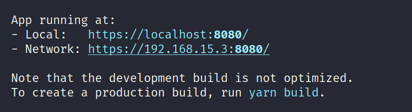
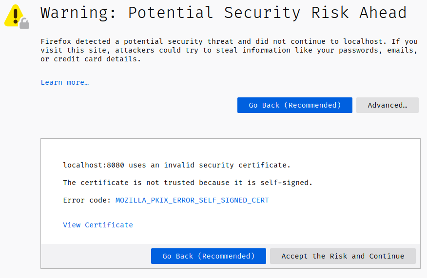

<p align="center">
  
</p>

# Preguiça WebApp

Front-end do projeto **preguiça.money** 

# Ajuda

* Telegram: https://t.me/preguica_money


# Backend
* https://github.com/codigoDeHonra/preguica-api


## Instalação

### Requisitos
* yarn 

### Instalação

Instalar as dependencias:  
```
yarn install
```

Edite o seu /etc/hosts (OPCIONAL):  

Adicione esta linha:  
```
127.0.0.1 app.xn--preguia-zxa.money
```

### Iniciando o servidor de desenvolvimento

```
yarn serve
```

Você vera algo parecido:   


Acesse o navegador:
* https://localhost:8080/
* https://192.168.15.3:8080/

No primeiro acesso vai pedir para aceitar o certificado digital.  
  


Make money!

Icons made by <a href="https://www.flaticon.com/authors/freepik" title="Freepik">Freepik</a> from <a href="https://www.flaticon.com/" title="Flaticon"> www.flaticon.com</a>
